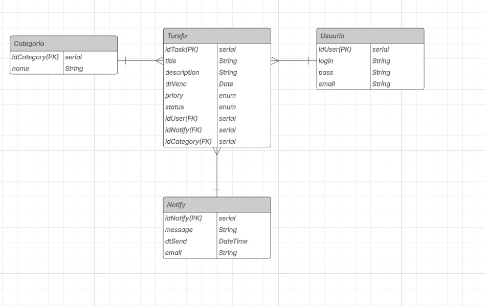

# Documento de Requisitos - Sistema To-Do List

## 1. Introdução

Este documento apresenta a definição de requisitos para o projeto do Sistema de Informação **To-Do List**, oferecendo uma visão geral da solução proposta para o gerenciamento de tarefas diárias por usuários individuais. O sistema busca atender à crescente demanda por organização pessoal e produtividade, permitindo que usuários registrem, acompanhem e priorizem suas atividades de forma eficiente.

## 2. Descrição do Propósito do Sistema

O propósito do Sistema de Informação To-Do List é fornecer uma plataforma digital intuitiva e segura para o gerenciamento de tarefas, visando melhorar a organização pessoal dos usuários, a produtividade diária e o controle do tempo.

O sistema permitirá que cada usuário cadastre-se e gerencie suas tarefas individualmente, com funcionalidades para criação, edição, exclusão e visualização de tarefas, além da organização por categorias personalizadas. Tarefas poderão ser filtradas por status, prioridade, data de vencimento e categoria, proporcionando uma visualização clara e segmentada das obrigações do dia a dia.

Além disso, o sistema oferecerá suporte a notificações ou lembretes sobre tarefas com vencimento próximo, auxiliando o usuário a manter o foco e cumprir prazos com maior eficiência. Todas as interações ocorrerão em um ambiente seguro, com autenticação criptografada, e adaptado para diferentes dispositivos.

---

## 3. Stack Tecnológica

### Frontend
- **Tecnologia:** React.js  
- **Estilo Responsivo:** CSS Flexbox e Grid Layout

### Backend
- **Tecnologia:** Spring Boot (Java)  
- **Estrutura:** Arquitetura em camadas padrão MVC (Controller, Service, Repository)  
- **Segurança:** Autenticação com Spring Security + JWT (JSON Web Token)

### Banco de Dados
- **SGDB:** PostgreSQL  
- **Relacionamentos:** Mapeados via JPA/Hibernate

---

## 4. Especificação de Requisitos

### 4.1 Requisitos Funcionais

| ID    | Descrição                          | Depende de | Interessados | Responsável |
|-------|------------------------------------|------------|--------------|-------------|
| RF01  | Cadastro de Usuários               | –          | –            | –           |
| RF02  | Autenticação do Usuário            | RF01       | –            | –           |
| RF03  | Cadastro de Tarefas                | RF02       | –            | –           |
| RF04  | Edição e Exclusão da Tarefa        | RF03       | –            | –           |
| RF05  | Criação de Categorias Personalizada| –          | –            | –           |
| RF06  | Filtro de Tarefas                  | RF03       | –            | –           |
| RF07  | Sistema de notificação             | RF03       | –            | –           |

#### Detalhamento dos Requisitos Funcionais

**RF01 - Cadastro de Usuários:**  
O sistema deve permitir que novos usuários se cadastrem, informando dados como nome, e-mail e senha. Cada conta deve ser individual e protegida por autenticação segura.

**RF02 - Autenticação do Usuário:**  
O sistema deve permitir que o usuário acesse sua conta por meio de login com e-mail e senha, garantindo segurança através de validação de credenciais e criptografia de senha.

**RF03 - Cadastro de Tarefas:**  
O sistema deve permitir que o usuário cadastre tarefas informando título, descrição, data de vencimento, prioridade, status e, opcionalmente, uma categoria associada.

**RF04 - Edição e Exclusão da Tarefa:**  
O sistema deve permitir que o usuário edite ou exclua tarefas previamente cadastradas, atualizando ou removendo seus dados de forma segura e prática.

**RF05 - Criação de Categorias Personalizadas:**  
O sistema deve permitir que o usuário crie categorias personalizadas para organizar suas tarefas, como “Trabalho”, “Estudos” ou “Pessoal”, de forma livre e individual.

**RF06 - Filtro de Tarefas:**  
O sistema deve oferecer filtros para que o usuário visualize suas tarefas com base em critérios como status, data de vencimento, prioridade ou categoria, facilitando a organização e o planejamento.

**RF07 - Sistema de Notificação:**  
O sistema deve, de forma opcional, enviar notificações ou lembretes automáticos ao usuário sobre tarefas próximas do vencimento, conforme preferências configuradas, ajudando na gestão do tempo.

---

### 4.2 Requisitos Não Funcionais

| ID     | Descrição                        | Categoria      | Depende de | Aplica-se a          |
|--------|----------------------------------|----------------|------------|----------------------|
| RNF01  | Interface Responsiva             | Portabilidade  | –          | Frontend             |
| RNF02  | Senhas Criptografadas            | Segurança      | –          | Backend              |
| RNF03  | Interface Amigável               | Usabilidade    | –          | Frontend             |
| RNF04  | Tempo de Operações CRUD          | Desempenho     | –          | Frontend + Backend   |

#### Detalhamento dos Requisitos Não Funcionais

**RNF01 - Interface Responsiva:**  
A interface do sistema deve ser responsiva, garantindo uma experiência de uso adequada em diferentes dispositivos e tamanhos de tela, incluindo desktops, tablets e smartphones. O layout deve se adaptar dinamicamente para oferecer boa usabilidade e acessibilidade, independentemente do dispositivo utilizado.

**RNF02 - Senhas Criptografadas:**  
As senhas dos usuários devem ser armazenadas de forma segura utilizando criptografia, garantindo confidencialidade e proteção contra acessos indevidos.

**RNF03 - Interface Amigável:**  
A interface do sistema deve ser intuitiva e de fácil navegação, utilizando elementos visuais claros e bem organizados, com foco na usabilidade para todos os perfis de usuários.

**RNF04 - Tempo de Operações CRUD:**  
As operações de criação, leitura, atualização e exclusão (CRUD) devem ser executadas de forma eficiente, com tempo de resposta rápido, garantindo um desempenho satisfatório para o usuário final.

---
### Diagrama de Classes UML

### Diagrama ER

### Diagrama de de Processos de negócios

### Diagrama de Caso de Uso Do-To List

